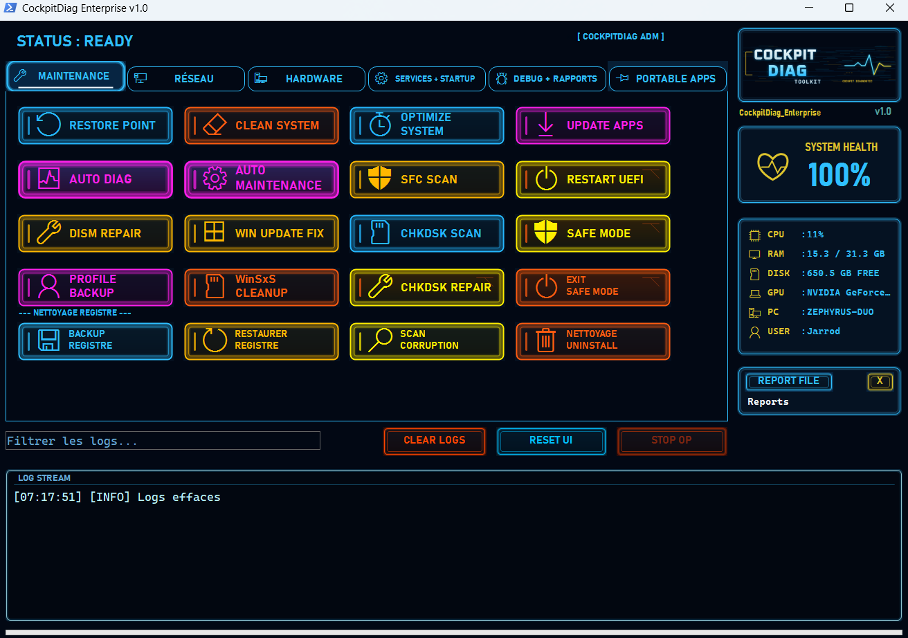

# CockpitDiag Enterprise


CockpitDiag Enterprise est une suite professionnelle portable pour le diagnostic, la maintenance, le reporting et l'assistance technique Windows.

Developpe et edite par Jarrod Barraco, entrepreneur individuel, regime micro-entreprise, exercant sous le nom commercial Toolkit Software Solution.

Ce depot public est une vitrine de release et de verification. Il ne contient pas le code source proprietaire de CockpitDiag Enterprise.



## Telechargement

Release actuelle : `v1.0`  
Date de publication : `2026-06-10`  
Canal : lien prive non indexe  
Licence client : `license.json` fourni separement aux clients autorises

ZIP client :

```text
https://toolkitsoftware.tech/downloads/private/cockpitdiag-v1-0-20260610-f8276780/CockpitDiag_Enterprise_v1.0.zip
```

Empreinte SHA256 attendue :

```text
f8276780a1c9959e5c1c2869e51ca0e5e232c3cb2e9cef4467eb0d02d5a4139f
```

Fichiers de verification :

- [SHA256SUMS.txt](release/v1.0/SHA256SUMS.txt)
- [release-manifest.json](release/v1.0/release-manifest.json)

Important : toute personne disposant du lien peut telecharger le ZIP. La licence d'activation reste fournie separement.

## Verifier Le Fichier

Sous Windows PowerShell, depuis le dossier ou se trouve le ZIP :

```powershell
Get-FileHash .\CockpitDiag_Enterprise_v1.0.zip -Algorithm SHA256
```

La valeur affichee doit etre exactement :

```text
f8276780a1c9959e5c1c2869e51ca0e5e232c3cb2e9cef4467eb0d02d5a4139f
```

Si la valeur est differente, ne lancez pas le fichier et contactez le support.

## Fonctions Principales

- Diagnostic systeme Windows.
- Maintenance guidee : SFC, DISM, CHKDSK, registre, nettoyage.
- Rapports HTML et JSON.
- Generation de prompt IA anonymise en mode manuel.
- Centre d'applications portables configurable.
- Analyse sante systeme et logs locaux.
- Validation de licence via module dedie `CockpitDiag.Licensing.dll`.

## Installation Rapide

1. Telecharger le ZIP.
2. Verifier le SHA256.
3. Extraire le ZIP dans un dossier local.
4. Copier le fichier `license.json` fourni separement a la racine du dossier extrait.
5. Lancer `CockpitDiag.exe` en administrateur.

Guide complet : [docs/INSTALL.md](docs/INSTALL.md)

## Licence Client

Le fichier `license.json` n'est pas inclus dans ce depot ni dans le ZIP public. Il est fourni separement aux clients ou testeurs autorises.

Ne publiez jamais votre fichier `license.json`.

Plus de details : [docs/LICENSING.md](docs/LICENSING.md)

## IA Et Services Tiers

CockpitDiag Enterprise peut generer un prompt anonymise pret a copier dans un assistant IA externe. Aucune donnee n'est envoyee automatiquement par CockpitDiag.

Toolkit Software Solution ne fournit, ne revend et ne sous-licencie aucun credit, compte, token, cle API ou acces API de fournisseur IA tiers.

L'utilisateur utilise ses propres comptes, cles API, credits ou acces aux services IA concernes. Il reste seul responsable des donnees qu'il copie, colle, transmet ou soumet a un fournisseur IA externe.

Confidentialite et donnees : [docs/PRIVACY.md](docs/PRIVACY.md)

## Documents

- [Licence proprietaire](LICENSE.txt)
- [EULA](docs/EULA.md)
- [Security Policy](SECURITY.md)
- [NOTICE](NOTICE)
- [Guide d'installation](docs/INSTALL.md)
- [Licensing](docs/LICENSING.md)
- [Privacy](docs/PRIVACY.md)
- [FAQ](docs/FAQ.md)
- [Support](SUPPORT.md)
- [Changelog](CHANGELOG.md)

## Support

Pour une licence, une activation, un changement de machine ou un signalement : contact@toolkitsoftware.tech
